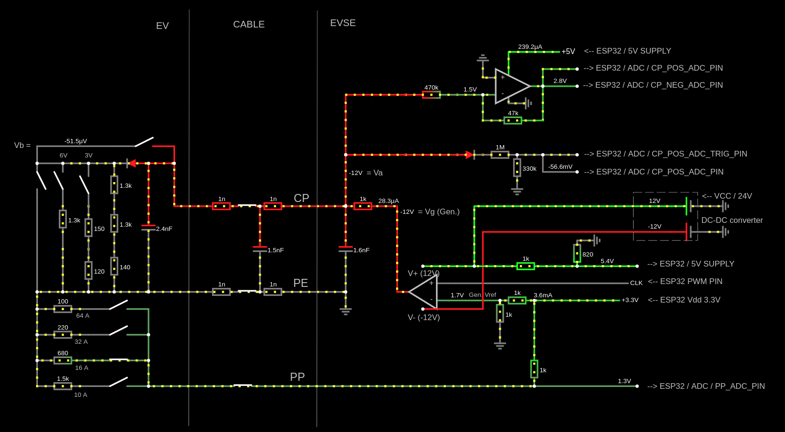

# EVSE Charge Controller Module for ESP32

## Features

- Based on **IEC 61851**, _"Mode 3"_ charging (1-3 phase AC)
- Charging can be started/stopped through **WiFi interface**

> Important: Don't attempt to assemble any high voltage circuits without a certified professional!

## Circuit Implementation

### Control Pilot (CP) and Proximity Pilot (PP) circuit for communication with EV

Interactive simulation: https://tinyurl.com/2cvle84c

### Contactor drive circuit (for charging)

Interactive simulation: https://tinyurl.com/2aohd9gd

## WiFi Control Interface

Working principal: On boot, a TCP server will start and will be listening for client connections. Once a client is connected, it can send plain text messages to control the EVSE.

API:

| Message   | Description                                                                            |
| --------- | -------------------------------------------------------------------------------------- |
| start\n   | Charging is permitted. Charging will start when the EV is properly connected.          |
| stop\n    | Charging is not permitted. If charging is in progress, charging will stop immediately. |
| status?\n | Returns status information about the EVSE.                                             |

## ESP32 GPIO designation

Below is a representation of a physical ESP module in a top-down view.

> You can use the "My Macro" column to note down what macro you use for that pin in your app
> I've added some examples for the macros

| Notes           | My Macro             | GPIO      | #   | GPIO      | My Macro  | Notes              |
| --------------- | -------------------- | --------- | --- | --------- | --------- | ------------------ |
| **3V3**         | X                    | **_3V3_** | 19  | **_GND_** | X         | **GND**            |
| **RESET**       | X                    | **_EN_**  | 18  | **_23_**  |           |                    |
| **INPUT_ONLY**  | CP_POS_ADC_PIN       | **_36_**  | 17  | **_22_**  |           |                    |
| **INPUT_ONLY**  | CP_POS_ADC_TRIG_PIN  | **_39_**  | 16  | **_1_**   |           | **USB_PROG_DEBUG** |
| **INPUT_ONLY**  | CP_NEG_ADC_PIN       | **_34_**  | 15  | **_3_**   |           | **USB_PROG_DEBUG** |
| **INPUT_ONLY**  | CP_NEG_ADC_TRIG_PIN  | **_35_**  | 14  | **_21_**  |           |                    |
|                 | PP_ADC_PIN           | **_32_**  | 13  | **_GND_** | X         | **GND**            |
|                 |                      | **_33_**  | 12  | **_19_**  |           |                    |
|                 |                      | **_25_**  | 11  | **_18_**  |           |                    |
|                 |                      | **_26_**  | 10  | **_5_**   |           | **PWM_AT_BOOT**    |
|                 | CONTACTOR_PIN        | **_27_**  | 9   | **_17_**  | PWM_PIN_2 |                    |
| **PWM_AT_BOOT** | CALIBRATE_BTN_PIN    | **_14_**  | 8   | **_16_**  | PWM_PIN   |                    |
|                 | CONTACTOR_ENABLE_PIN | **_12_**  | 7   | **_4_**   |           |                    |
| **GND**         | X                    | **_GND_** | 6   | **_0_**   | !         | **BOOT_H_PROG_L**  |
|                 |                      | **_13_**  | 5   | **_2_**   |           |                    |
| **FORBIDDEN**   |                      | **_9_**   | 4   | **_15_**  |           | **PWM_AT_BOOT**    |
| **FORBIDDEN**   |                      | **_10_**  | 3   | **_8_**   |           | **FORBIDDEN**      |
| **FORBIDDEN**   |                      | **_11_**  | 2   | **_7_**   |           | **FORBIDDEN**      |
|                 |                      | **_5V_**  | 1   | **_6_**   |           | **FORBIDDEN**      |

## GPIO description

| MACRO                | USE                                                                                                                |
| -------------------- | ------------------------------------------------------------------------------------------------------------------ |
| CP_POS_ADC_PIN       | Used to measure CP positive peak voltage. Connected to CP (via voltage divider and voltage follower).              |
| CP_POS_ADC_TRIG_PIN  | Used to trigger the ADC of the CP_POS_ADC_PIN. Triggers the CP_POS_ADC_ISR interrupt. Connected to CP_POS_ADC_PIN. |
| CP_NEG_ADC_PIN       | Used to measure CP negative peak voltage. Connected to CP (via voltage divider and voltage follower).              |
| CP_NEG_ADC_TRIG_PIN  | Used to trigger the ADC of the CP_NEG_ADC_PIN. Triggers the CP_NEG_ADC_ISR interrupt. Connected to CP_NEG_ADC_PIN. |
| PWM_PIN              | Source of the CP PWM. 1kHz, variable duty cycle.                                                                   |
| PWM_PIN_2            | Source of the CP PWM. Identical to the PWM_PIN signal. Used to trigger the ADC.                                    |
| CONTACTOR_PIN        | Starts/stops the charging.                                                                                         |
| CONTACTOR_ENABLE_PIN | Enables charging (safety step).                                                                                    |
| CALIBRATE_BTN_PIN    | Automatic calibration feature (under development)                                                                  |

## TODO

- connector lock control
- controller status (CP, PP, contactor) send over WiFi interface
