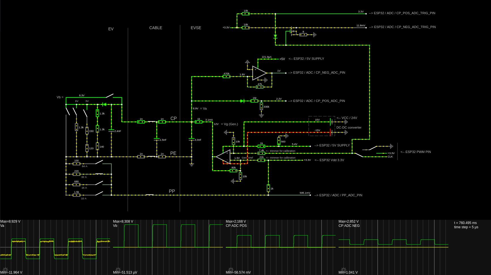
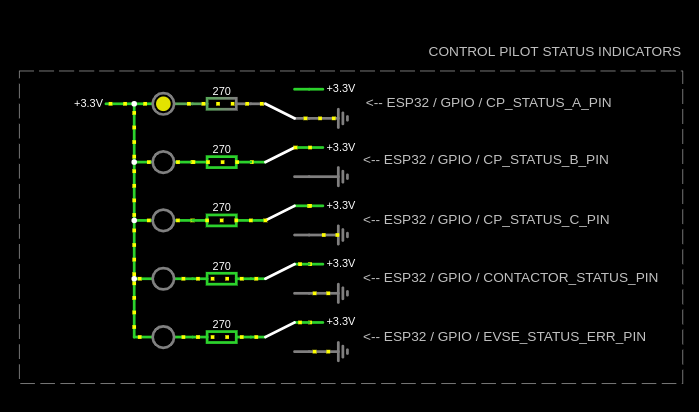

# EVSE Charge Controller Module for ESP32

Embedded system for controlling Electric Vehicle Supply Equipment (=EVSE). Based on **IEC 61851**.

## Features

- Implemented functions specified in **IEC 61851** for _"Mode 3"_ charging (1-3 phase AC)
- **WiFi Interface** for connecting with UI and/or OCPP client module

## Getting started

To use this project, you will need to install [Platformio](https://platformio.org/).

If necessary, modify the USB port name in the platformio.ini file to correspond to the USB port name on your machine.

## Hardware

This repository describes 2 types of hardware implementation:

1. EVSE full implementation: this circuit incorporates an actual AC charger
2. EVSE simulator implementation: this only simulates an EVSE for development purposes (e.g. to help develop UI module or OCPP client module for an EVSE)

The software in this repository is designed to work identically in both implementations.

This project was developed and tested on the NodeMCU-32S ESP32 Development Board, with the following sepcification:

- ESP-WROOM-32 module with Espressif ESP32 dual core processor with 802.11 b/g/n WiFi and Bluetooth 4.0 LE
- 2x19 pin GPIOs, Analog inputs (ADC), UART, I2C, VP/VN
- USB: 1x micro USB port for power and programming
- Power Supply: 5V via USB or Vin pin
  > Note: Heavy WiFi use requires extra power. I have made and extra Micro USB port for secondary power supply.
- Dimensions: 49.5 x 26 mm

### 1. EVSE FULL IMPLEMENTATION (unrealized, untested)

#### 1.A. Control Pilot (CP) and Proximity Pilot (PP) circuit for communication with EV

The purpose of this circuit is to establish PWM communication with the EV (CP circuit) and to check the capacity of cable (PP).

Detailed specification: CP: _IEC 61851-1:2017, Annex A_, PP: _IEC 61851-1:2017, Annex B, B.2_

Interactive diagram: https://tinyurl.com/2kqn36ny

#### 1.B. Contactor drive circuit

Interactive diagram: https://tinyurl.com/2aohd9gd

### 2. EVSE SIMULATOR IMPLEMENTATION (built, tested)

#### 2.A. Control Pilot (CP) and Proximity Pilot (PP) measurement simulation

This circuit is designed to simulate ADC readings of the CP and PP circuits.

Interactive diagram: https://tinyurl.com/2pnmm4mg

#### 2.B. Status indicator leds

#### 2.C. Finished implementation:

**Toggle button (blue):**

- unpressed state: EV not connected (CP state A)
- pressed state: EV connected (CP state B)

**Slide switch (black):**

- right state: EV is connected, but not ready to accept charge (CP state B)
- left state: EV is ready to accept charge, charging can begin (CP state C)

**Trimmer resistors (blue, from top to bottom):**

- trimmer 1: adjust the voltage corresponding to CP state C
- trimmer 2: adjust the voltage corresponding to CP state B
- trimmer 3: adjust the resistance corresponding to cable capacity (PP)

**LEDs:**

- yellow LED 1: CP state A
- yellow LED 2: CP state B
- yellow LED 3: CP state C
- green LED 4: EVSE contactor is on, EV charging began
- red LED 5: EVSE is in an error state, charging is not possible

**USB ports:**

- dev board USB port: power supply, programming, debugging
- secondary USB port: extra power supply

## WiFi Control Interface

On boot, a TCP server will start and will be listening for client connections over WiFi. Once a client is connected, it can send plain text messages to control the EVSE and get status information, meter values etc.

### API

#### Messages sent to the EVSE

| Message          | Description                                                                                                          |
| ---------------- | -------------------------------------------------------------------------------------------------------------------- |
| [SERVERPASSWORD] | The 20 character ASCII password must be sent within 5s of first connection. This is set in the SERVERPASSWORD macro. |
| start\n          | Charging is permitted. Charging will start when the EV is properly connected.                                        |
| stop\n           | Charging is not permitted. If charging is in progress, charging will stop immediately.                               |
| status?\n        | Returns status information about the EVSE.                                                                           |
| metervalues?\n   | Returns status information about the EVSE.                                                                           |

#### Responses sent by the EVSE

Responses are in the following format [HEADER]:[CSV_VALUE_1],[CSV_VALUE_2],[CSV_VALUE_3],...

##### Response to **start\n**

| Section     | Value          | Meaning                                 |
| ----------- | -------------- | --------------------------------------- |
| HEADER      | "command"      | The response type is a command response |
| CSV_VALUE_1 | "OK" / "ERROR" | The command succeeded or failed         |

example response: "command:OK,"

##### Response to **stop\n**

| Section     | Value          | Meaning                                 |
| ----------- | -------------- | --------------------------------------- |
| HEADER      | "command"      | The response type is a command response |
| CSV_VALUE_1 | "OK" / "ERROR" | The command succeeded or failed         |

example response: "command:OK,"

##### Response to **status?\n**

| Section     | Value    | Meaning                                                               |
| ----------- | -------- | --------------------------------------------------------------------- |
| HEADER      | "status" | The response type is a status response                                |
| CSV_VALUE_1 | 1 / 0    | An EV is plugged in or not                                            |
| CSV_VALUE_2 | 1 / 0    | Charging allowed or not (by an external command)                      |
| CSV_VALUE_3 | 1 / 0    | Charging is in progress oer not (determined by internal charge logic) |
| CSV_VALUE_4 | 1 / 0    | EVSE is in an error state (CP E or F state) or not                    |

example response: "status:1,0,0,0,"

##### Response to **status?\n**

| Section     | Value              | Meaning                                      |
| ----------- | ------------------ | -------------------------------------------- |
| HEADER      | "metervalues"      | The response type is a meter values response |
| CSV_VALUE_1 | fixed point number | Energy active net (Wh). Integer.             |
| CSV_VALUE_2 | fixed point number | Power active import (W). Integer.            |

example response: "metervalues:16845,4567,"

## ESP32 GPIO designation

Below is a representation of a physical ESP32 Development Board in a top-down view.

| Notes           | Macro                | GPIO      | #   | GPIO      | Macro                | Notes              |
| --------------- | -------------------- | --------- | --- | --------- | -------------------- | ------------------ |
| **3V3**         | X                    | **_3V3_** | 19  | **_GND_** | X                    | **GND**            |
| **RESET**       | X                    | **_EN_**  | 18  | **_23_**  |                      |                    |
| **INPUT_ONLY**  | CP_POS_ADC_PIN       | **_36_**  | 17  | **_22_**  |                      |                    |
| **INPUT_ONLY**  | CP_POS_ADC_TRIG_PIN  | **_39_**  | 16  | **_1_**   |                      | **USB_PROG_DEBUG** |
| **INPUT_ONLY**  | CP_NEG_ADC_PIN       | **_34_**  | 15  | **_3_**   |                      | **USB_PROG_DEBUG** |
| **INPUT_ONLY**  | CP_NEG_ADC_TRIG_PIN  | **_35_**  | 14  | **_21_**  |                      |                    |
|                 | PP_ADC_PIN           | **_32_**  | 13  | **_GND_** | X                    | **GND**            |
|                 | CONTACTOR_PIN        | **_33_**  | 12  | **_19_**  |                      |                    |
|                 | CP_STATUS_A_PIN      | **_25_**  | 11  | **_18_**  |                      |                    |
|                 | CP_STATUS_B_PIN      | **_26_**  | 10  | **_5_**   |                      | **PWM_AT_BOOT**    |
|                 | CP_STATUS_C_PIN      | **_27_**  | 9   | **_17_**  | PWM_PIN_2            |                    |
| **PWM_AT_BOOT** | CONTACTOR_STATUS_PIN | **_14_**  | 8   | **_16_**  | PWM_PIN              |                    |
|                 | EVSE_STATUS_ERR_PIN  | **_12_**  | 7   | **_4_**   | CONTACTOR_ENABLE_PIN |                    |
| **GND**         | X                    | **_GND_** | 6   | **_0_**   | !                    | **BOOT_H_PROG_L**  |
|                 | PWM_PIN_3            | **_13_**  | 5   | **_2_**   |                      |                    |
| **FORBIDDEN**   |                      | **_9_**   | 4   | **_15_**  |                      | **PWM_AT_BOOT**    |
| **FORBIDDEN**   |                      | **_10_**  | 3   | **_8_**   |                      | **FORBIDDEN**      |
| **FORBIDDEN**   |                      | **_11_**  | 2   | **_7_**   |                      | **FORBIDDEN**      |
|                 |                      | **_5V_**  | 1   | **_6_**   |                      | **FORBIDDEN**      |

## GPIO description

| MACRO                | USE                                                                                                                |
| -------------------- | ------------------------------------------------------------------------------------------------------------------ |
| CP_POS_ADC_PIN       | Used to measure CP positive peak voltage. Connected to CP.                                                         |
| CP_POS_ADC_TRIG_PIN  | Used to trigger the ADC of the CP_POS_ADC_PIN. Triggers the CP_POS_ADC_ISR interrupt. Connected to CP_POS_ADC_PIN. |
| CP_NEG_ADC_PIN       | Used to measure CP negative peak voltage. Connected to CP.                                                         |
| CP_NEG_ADC_TRIG_PIN  | Used to trigger the ADC of the CP_NEG_ADC_PIN. Triggers the CP_NEG_ADC_ISR interrupt. Connected to CP_NEG_ADC_PIN. |
| PP_ADC_PIN           | Used to measure the cable capacity indicating resistance (PP circuit).                                             |
| CP_STATUS_A_PIN      | Indicates that the CP circuit is in state A.                                                                       |
| CP_STATUS_B_PIN      | Indicates that the CP circuit is in state B.                                                                       |
| CP_STATUS_C_PIN      | Indicates that the CP circuit is in state C.                                                                       |
| CONTACTOR_PIN        | Indicates that the grid voltage is connected to the EV, charging is started.                                       |
| EVSE_STATUS_ERR_PIN  | Indicates that the EVSE is in an error state (CP state E or F), and charging is not possible.                      |
| CONTACTOR_ENABLE_PIN | Enables charging (safety step).                                                                                    |
| PWM_PIN              | Source of the CP PWM. 1kHz, variable duty cycle.                                                                   |
| PWM_PIN_2            | Source of the CP PWM. Identical to the PWM_PIN signal. Used to trigger the ADC.                                    |

## TODO

- connector lock control
- multi-level debug logging
- be able to control PWM duty cycle over the WiFi interface
