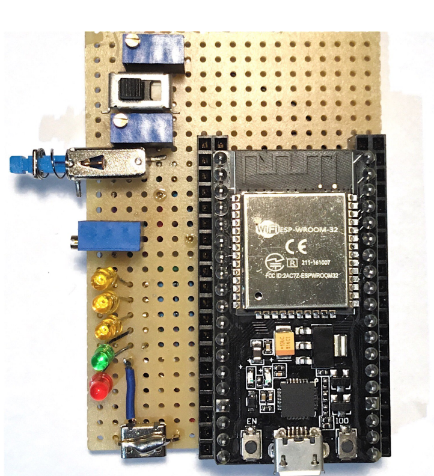

# EVSE Charge Controller Module for ESP32

Embedded system for controlling Electric Vehicle Supply Equipment (=EVSE). Based on **IEC 61851**.

## Features

- Implemented functions specified in **IEC 61851** for _"Mode 3"_ charging (1-3 phase AC)
- **WiFi Interface** for connecting with UI and/or OCPP client module

## Hardware

This repository describes 2 types of hardware implementation:

1. EVSE full implementation: this circuit incorporates an actual AC charger
2. EVSE simulator implementation: this only simulates an EVSE for development purposes (e.g. to help develop UI module or OCPP client module for an EVSE)

The software in this repository is designed to work identically in both implementations.

This project was developed and tested on the NodeMCU-32S ESP32 Development Board, with the following sepcification:

- ESP-WROOM-32 module with Espressif ESP32 dual core processor with 802.11 b/g/n WiFi and Bluetooth 4.0 LE
- 2x19 pin GPIOs, Analog inputs (ADC), UART, I2C, VP/VN
- USB: 1x micro USB port for power and programming
- Power Supply: 5V via USB or Vin pin
  > Note: Heavy WiFi use requires extra power. I have made and extra Micro USB port for secondary power supply.
- Dimensions: 49.5 x 26 mm

### 1. EVSE full hardware implementation (unrealized, untested)

#### 1.A. Control Pilot (CP) and Proximity Pilot (PP) circuit for communication with EV

The purpose of this circuit is to establish PWM communication with the EV (CP circuit) and to check the capacity of cable (PP).

Detailed specification: CP: _IEC 61851-1:2017, Annex A_, PP: _IEC 61851-1:2017, Annex B, B.2_

Interactive diagram: https://tinyurl.com/2zzmrygw

#### 1.B. Contactor drive circuit

Interactive diagram: https://tinyurl.com/2aohd9gd

### 2. EVSE simulator hardware implementation (finished)

#### 2.A. Control Pilot (CP) and Proximity Pilot (PP) measurement simulation

This circuit is designed to simulate ADC readings of the CP and PP circuits.

Interactive diagram: https://tinyurl.com/2qgj2qfu

#### 2.B. Status indicator leds

- yellow led 1: CP state A
- yellow led 2: CP state B
- yellow led 3: CP state C
- green led 4: EVSE contactor is on, EV charging began
- red led 5: EVSE is in an error state, charging is not possible

#### 2.C Finished implementation:

The pressed state of the toggle button (blue) on the left side simulates connecting the EV supply cable to the EVSE (CP state A).

The rightward state of the slide switch (black) means the EV is connected, but not ready to accept charge (CP state B), the leftward state of the switch means the EV is ready to accept charge (CP state C).

## WiFi Control Interface

Working principal: On boot, a TCP server will start and will be listening for client connections. Once a client is connected, it can send plain text messages to control the EVSE.

API:

| Message        | Description                                                                            |
| -------------- | -------------------------------------------------------------------------------------- |
| start\n        | Charging is permitted. Charging will start when the EV is properly connected.          |
| stop\n         | Charging is not permitted. If charging is in progress, charging will stop immediately. |
| status?\n      | Returns status information about the EVSE.                                             |
| metervalues?\n | Returns status information about the EVSE.                                             |

## ESP32 GPIO designation

Below is a representation of a physical ESP module in a top-down view.

> You can use the "My Macro" column to note down what macro you use for that pin in your app
> I've added some examples for the macros

| Notes           | My Macro             | GPIO      | #   | GPIO      | My Macro  | Notes              |
| --------------- | -------------------- | --------- | --- | --------- | --------- | ------------------ |
| **3V3**         | X                    | **_3V3_** | 19  | **_GND_** | X         | **GND**            |
| **RESET**       | X                    | **_EN_**  | 18  | **_23_**  |           |                    |
| **INPUT_ONLY**  | CP_POS_ADC_PIN       | **_36_**  | 17  | **_22_**  |           |                    |
| **INPUT_ONLY**  | CP_POS_ADC_TRIG_PIN  | **_39_**  | 16  | **_1_**   |           | **USB_PROG_DEBUG** |
| **INPUT_ONLY**  | CP_NEG_ADC_PIN       | **_34_**  | 15  | **_3_**   |           | **USB_PROG_DEBUG** |
| **INPUT_ONLY**  | CP_NEG_ADC_TRIG_PIN  | **_35_**  | 14  | **_21_**  |           |                    |
|                 | PP_ADC_PIN           | **_32_**  | 13  | **_GND_** | X         | **GND**            |
|                 | CP_STATUS_A_PIN      | **_33_**  | 12  | **_19_**  |           |                    |
|                 | CP_STATUS_B_PIN      | **_25_**  | 11  | **_18_**  |           |                    |
|                 | CP_STATUS_C_PIN      | **_26_**  | 10  | **_5_**   |           | **PWM_AT_BOOT**    |
|                 | CONTACTOR_PIN        | **_27_**  | 9   | **_17_**  | PWM_PIN_2 |                    |
| **PWM_AT_BOOT** | EVSE_STATUS_ERR_PIN  | **_14_**  | 8   | **_16_**  | PWM_PIN   |                    |
|                 | CONTACTOR_ENABLE_PIN | **_12_**  | 7   | **_4_**   |           |                    |
| **GND**         | X                    | **_GND_** | 6   | **_0_**   | !         | **BOOT_H_PROG_L**  |
|                 |                      | **_13_**  | 5   | **_2_**   |           |                    |
| **FORBIDDEN**   |                      | **_9_**   | 4   | **_15_**  |           | **PWM_AT_BOOT**    |
| **FORBIDDEN**   |                      | **_10_**  | 3   | **_8_**   |           | **FORBIDDEN**      |
| **FORBIDDEN**   |                      | **_11_**  | 2   | **_7_**   |           | **FORBIDDEN**      |
|                 |                      | **_5V_**  | 1   | **_6_**   |           | **FORBIDDEN**      |

## GPIO description

| MACRO                | USE                                                                                                                |
| -------------------- | ------------------------------------------------------------------------------------------------------------------ |
| CP_POS_ADC_PIN       | Used to measure CP positive peak voltage. Connected to CP (via voltage divider and voltage follower).              |
| CP_POS_ADC_TRIG_PIN  | Used to trigger the ADC of the CP_POS_ADC_PIN. Triggers the CP_POS_ADC_ISR interrupt. Connected to CP_POS_ADC_PIN. |
| CP_NEG_ADC_PIN       | Used to measure CP negative peak voltage. Connected to CP (via voltage divider and voltage follower).              |
| CP_NEG_ADC_TRIG_PIN  | Used to trigger the ADC of the CP_NEG_ADC_PIN. Triggers the CP_NEG_ADC_ISR interrupt. Connected to CP_NEG_ADC_PIN. |
| PWM_PIN              | Source of the CP PWM. 1kHz, variable duty cycle.                                                                   |
| PWM_PIN_2            | Source of the CP PWM. Identical to the PWM_PIN signal. Used to trigger the ADC.                                    |
| CONTACTOR_PIN        | Starts/stops the charging.                                                                                         |
| CONTACTOR_ENABLE_PIN | Enables charging (safety step).                                                                                    |
| CALIBRATE_BTN_PIN    | Automatic calibration feature (under development)                                                                  |

## TODO

- connector lock control
- controller status (CP, PP, contactor) send over WiFi interface
